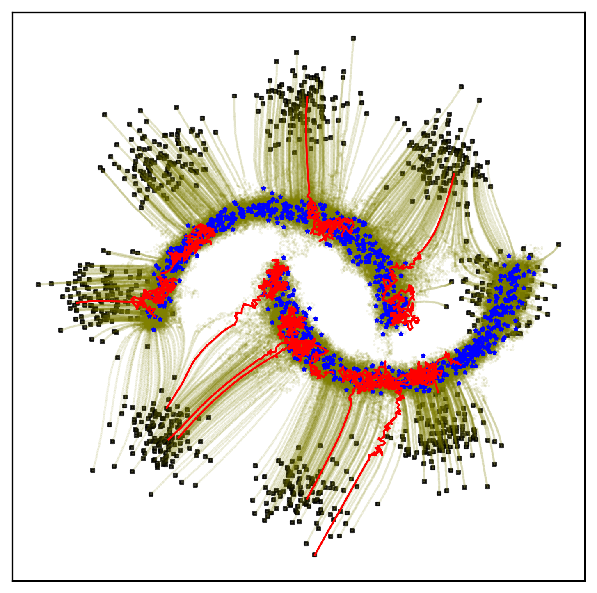

# Energy Matching


Energy Matching unifies flow matching and energy-based models in a single time-independent scalar field, enabling efficient transport between the source and target distributions while retaining explicit likelihood information for flexible, high-quality generation.

**Version 0.1** – This is the official repository for the paper [Energy Matching](https://arxiv.org/abs/2504.10612). Both the code and the
paper may change as the manuscript is undergoing revision.

### Setup (CUDA)
1. Create and activate a Python environment (conda example):
   ```bash
   conda create -n energy-matching python=3.10 -y
   conda activate energy-matching
   ```
2. Install PyTorch with CUDA support and the project requirements:
   ```bash
   pip install torch torchvision torchaudio --index-url https://download.pytorch.org/whl/cu118
   pip install -r requirements.txt
   ```

## Running the examples
- A simple 2D playground is provided in `experiments/toy2d/tutorial_2D.ipynb`.
- The CIFAR‑10 checkpoint is too large to include but can be trained using the commands below.

### CIFAR‑10 training and evaluation
Initial training:
```bash
torchrun --nproc_per_node=4 experiments/cifar10/train_cifar_multigpu.py --lr 8e-4 --batch_size 128 --epsilon_max 0.0 --n_gibbs 0 --lambda_cd 0. --time_cutoff 1.0 --ema_decay 0.9999 --save_step 5000
```
Fine‑tuning with Algorithm 2 (same script):
```bash
torchrun --nproc_per_node=4 experiments/cifar10/train_cifar_multigpu.py --lr 8e-4 --batch_size 64 --resume_ckpt 'path_to_pretrained' --epsilon_max 0.01 --n_gibbs 201 --lambda_cd 1e-4 --time_cutoff 0.9 --ema_decay 0.999 --save_step 100 --dt_gibbs 0.01 --cd_loss_threshold 1.0 --split_negative=True
```
Evaluation (multi‑GPU):
```bash
torchrun --nproc_per_node=2 experiments/cifar10/fid_cifar_heun_multigpu.py \
    --resume_ckpt=PATH \
    --output_dir=./sampling_results \
    --use_ema True \
    --time_cutoff 0.9 \
    --epsilon_max 0.01
```
The dataset path defaults to `./data` or can be overridden with the
`CIFAR10_PATH` environment variable.
No CIFAR‑10 checkpoint is included because the file is large, so training from scratch is required or you may provide your own checkpoint.
### Protein inverse design
Train the model and sample sequences with:
```bash
python experiments/proteins/train_proteins_latent.py
python experiments/proteins/sampling_latent.py
```
The VAE used for the continuous latent space is already provided.


## Citation

If you find our work useful, please consider citing:

```bibtex
@article{balcerak2025energy,
  title={Energy Matching: Unifying Flow Matching and Energy-Based Models for Generative Modeling},
  author={Balcerak, Michal and Amiranashvili, Tamaz and Terpin, Antonio and Shit, Suprosanna and Bogensperger, Lea and Kaltenbach, Sebastian and Koumoutsakos, Petros and Menze, Bjoern},
  journal={arXiv preprint arXiv:2504.10612},
  year={2025}
}
```
